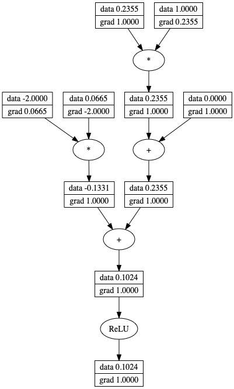

# micrograd


A tiny Autograd engine (with a bite! :D). Implements backpropagation (reverse-mode autodiff) over a dynamically built DAG and a small neural networks library on top of it with a PyTorch-like API. Both are currently about 50 lines of code each.

The DAG only allows individual scalar values, so e.g. we chop up each neuron into all of its individual tiny adds and multiplies. In particular, the current library only supports scalars and three operations over them: (+,*,relu), but in fact these are enough to build up an entire deep neural net doing binary classification, as the demo notebook shows. Potentially useful for educational purposes. See the notebook `demo.ipynb` for a full demo of training an MLP binary classifier.

### Example usage

```python
from micrograd.engine import Value

x = Value(1.0)
z = 2 * x + 2 + x
q = z + z * x
h = z * z
y = h + q + q * x
print(y.data) # prints 45.0
y.backward()
print(x.grad) # prints 62.0 - i.e. the numerical value of dy / dx
```

### Tracing / visualization

Have a look at the jupyter notebook `trace_graph.ipynb` to also produce graphviz visualizations. E.g. this one is of a simple 2D neuron, arrived at by calling `draw_dot` on the code below, and it shows both the data (top number in each node) and the gradient (bottom number in each node).

```python
from micrograd import nn
n = nn.Neuron(2)
x = [Value(1.0), Value(-2.0)]
y = n(x)
dot = draw_dot(y)
```


