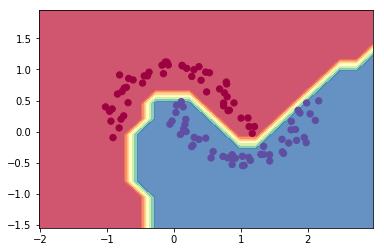
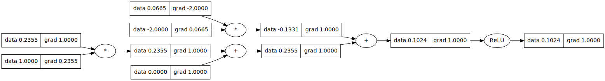

# micrograd


A tiny Autograd engine (with a bite! :)). Implements backpropagation (reverse-mode autodiff) over a dynamically built DAG and a small neural networks library on top of it with a PyTorch-like API. Both are tiny, with about 100 and 50 lines of code respectively. The DAG only operates over scalar values, so e.g. we chop up each neuron into all of its individual tiny adds and multiplies. However, this is enough to build up entire deep neural nets doing binary classification, as the demo notebook shows. Potentially useful for educational purposes.

### Installation

```bash
pip install micrograd
```

### Example usage

Below is a slightly contrived example showing a number of possible supported operations:

```python
from micrograd.engine import Value

a = Value(-4.0)
b = Value(2.0)
c = a + b
d = a * b + b**3
c += c + 1
c += 1 + c + (-a)
d += d * 2 + (b + a).relu()
d += 3 * d + (b - a).relu()
e = c - d
f = e**2
g = f / 2.0
g += 10.0 / f
print(f'{g.data:.4f}') # prints 24.7041, the outcome of this forward pass
g.backward()
print(f'{a.grad:.4f}') # prints 138.8338, i.e. the numerical value of dg/da
print(f'{b.grad:.4f}') # prints 645.5773, i.e. the numerical value of dg/db
```

### Training a neural net

The notebook `demo.ipynb` provides a full demo of training an 2-layer neural network (MLP) binary classifier. This is achieved by initializing a neural net from `micrograd.nn` module, implementing a simple svm "max-margin" binary classification loss and using SGD for optimization. As shown in the notebook, using a 2-layer neural net with two 16-node hidden layers we achieve the following decision boundary on the moon dataset:



### Tracing / visualization

For added convenience, the notebook `trace_graph.ipynb` produces graphviz visualizations. E.g. this one below is of a simple 2D neuron, arrived at by calling `draw_dot` on the code below, and it shows both the data (left number in each node) and the gradient (right number in each node).

```python
from micrograd import nn
n = nn.Neuron(2)
x = [Value(1.0), Value(-2.0)]
y = n(x)
dot = draw_dot(y)
```



### Running tests

To run the unit tests you will have to install [PyTorch](https://pytorch.org/), which the tests use as a reference for verifying the correctness of the calculated gradients. Then simply:

```bash
pytest
```

### Dependencies

There is a `requirements.txt` with the necessary dependencies.

```bash
pip install -r requirements.txt
```

### Just in Time Compilation

This repository also contains a JIT compiler for the micrograd engine using [mlir](https://mlir.llvm.org/) which is then lowered to LLVM IR and executed with a provided
CPU backend.

```python
def test_value():
    a = Value(4.0)
    b = Value(2.0)
    c = a + b  # 6.
    d = a + c  # 10.
    jd = jit(d)
    assert math.isclose(d.data, jd(), abs_tol=1e-04)

def test_mlp():
    random.seed(10)
    nn = MLP(nin=2, nouts=[1])
    jnn = jit(nn)
    args = [-30., -20.]
    assert math.isclose(nn(args).data, jnn(args), abs_tol=1e-04)
```

You can also print the JIT object returned to see the corresponding MLIR IR.
```python
>>> from micrograd.engine import Value
>>> from micrograd.jit import jit
>>> a = Value(4.0)
>>> b = Value(2.0)
>>> c = a + b
>>> jit_c = jit(c)
>>> print(jit_c)
module {
  llvm.func @main() -> f32 attributes {llvm.emit_c_interface} {
    %0 = llvm.mlir.constant(4.000000e+00 : f32) : f32
    %1 = llvm.mlir.constant(2.000000e+00 : f32) : f32
    %2 = llvm.mlir.constant(6.000000e+00 : f32) : f32
    llvm.return %2 : f32
  }
  llvm.func @_mlir_ciface_main() -> f32 attributes {llvm.emit_c_interface} {
    %0 = llvm.call @main() : () -> f32
    llvm.return %0 : f32
  }
}
```

### License

MIT
